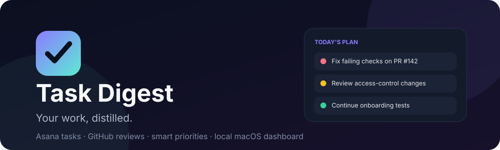
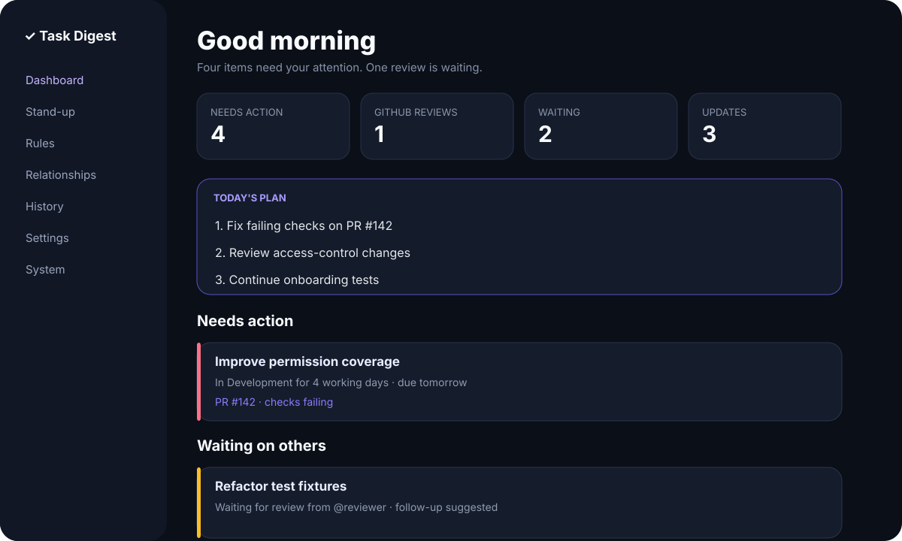

<p align="center">
  
</p>

<p align="center">
  
  
  
  
</p>

# Task Digest

**Task Digest is a private, local-first macOS work assistant that turns assigned Asana work and relevant GitHub activity into one prioritized daily dashboard.** It highlights what needs action, separates work that is waiting on others, builds a smart Today’s Plan, sends scheduled notifications, and keeps your notes, rules, snoozes, summaries, and history on your Mac.

<p align="center">
  
</p>

## Why Task Digest?

Most task systems tell you everything that exists. Task Digest focuses on **what you should do next**.

It combines:

- assigned Asana tasks, statuses, due dates, comments, dependencies, and sections;
- GitHub review requests, assigned issues, mentions, and your pull requests that need action;
- live status for GitHub pull requests linked to Asana tasks;
- working-day age, blockers, due dates, manual priorities, and configurable rules;
- a menu-bar summary, dynamic local dashboard, stand-up generator, history, and backups.

The dashboard binds to `127.0.0.1`, the Asana token is stored in macOS Keychain, and GitHub access uses your existing `gh` authentication.

## Highlights

| Area | What it does |
|---|---|
| **Smart prioritization** | Uses due dates, working-day age, GitHub blockers, dependencies, and visual rules. |
| **Today’s Plan** | Suggests a compact daily plan that you can accept, edit, and drag into order. |
| **Action vs waiting** | Separates work you can act on from work waiting for reviewers, CI, deployment, or dependencies. |
| **GitHub awareness** | Tracks requested reviews, assigned issues, mentions, authored PR blockers, and linked PR status. |
| **Asana context** | Reads sections, custom status, comments, dependencies, dependents, due dates, and task history. |
| **Local controls** | Notes, priority overrides, snooze, ignore, follow-up suggestions, and unread markers stay local. |
| **Automation** | Weekday morning/evening notifications, menu-bar app, saved reports, stand-ups, and backups. |
| **Local-first security** | Loopback-only dashboard, Keychain credential storage, no hosted Task Digest service. |

## How it works

```text
Asana API ───────────────┐
                         ├─> normalize → enrich → rules → priority → dashboard
GitHub CLI / GitHub API ─┘                              │
                                                       ├─> menu bar
Local state ────────────────────────────────────────────┼─> notifications
(notes, snoozes, rules, history, focus order)           └─> reports / stand-up
```

## Requirements

- macOS 13 or later
- Python 3.11 or 3.12
- An Asana account and personal access token
- GitHub CLI (`gh`) if GitHub integration is enabled
- Access to the Asana workspace and GitHub repositories you configure

Task Digest is currently designed for **one person running it locally on one Mac**. Asana recommends OAuth for distributed multi-user applications; this project uses a personal access token because it is a personal local tool.

## Quick start

### 1. Clone the repository

```bash
git clone https://github.com/YOUR-USERNAME/task-digest-macos.git
cd task-digest-macos
```

### 2. Install prerequisites

With Homebrew:

```bash
brew install python@3.12 gh
```

Optional notification action buttons:

```bash
brew install vjeantet/tap/alerter
```

### 3. Run the guided setup

```bash
scripts/setup_local.sh
```

The setup wizard will:

1. create `.venv` and install dependencies;
2. copy `.env.example` to `.env`;
3. securely store your Asana token in macOS Keychain;
4. list your Asana workspaces and ask for the workspace GID;
5. authenticate GitHub CLI and ask which repositories to monitor;
6. run the tests;
7. build `~/Applications/Task Digest.app`;
8. install the login and weekday schedule agents.

When it finishes, open:

```text
http://127.0.0.1:8765
```

Or use the **Task Digest** item in the macOS menu bar.

> Prefer to understand every command? Follow the [manual setup guide](docs/SETUP.md).

## First-run checklist

After installation:

1. Open **System** and confirm Asana, GitHub, the app, and the scheduled digest are green.
2. Click **Test notification** and allow notifications in macOS System Settings if prompted.
3. Open **Settings** and review statuses, hidden sections, notification times, and repositories.
4. Keep **One-click Asana updates** disabled until you are comfortable with the dashboard.
5. Open **Rules** to tune how your workflow is classified.

## Main pages

| Page | Purpose |
|---|---|
| `/` | Dashboard, Today’s Plan, tasks, GitHub work, waiting work, and optional investigations |
| `/standup` | Generates editable short or detailed daily stand-up text |
| `/rules` | Visual priority, classification, visibility, and follow-up rules |
| `/relationships` | Dependency maps and recommended upstream “Start here” tasks |
| `/history` | Morning/evening reports and saved stand-ups |
| `/hidden` | Snoozed and ignored items |
| `/backups` | Create, download, and restore local backups |
| `/settings` | Manage routine configuration without editing `.env` |
| `/system` | Service health, authentication, logs, refresh, repair, and notification testing |

## Everyday use

Once installed, Terminal is normally unnecessary.

- Click the menu-bar item for a quick overview.
- Open the dashboard to accept or reorder Today’s Plan.
- Expand task cards for comments, dependencies, activity, local notes, and controls.
- Use **Snooze**, **Until change**, or **Ignore** to reduce noise.
- Use **Mark updates read** for Task Digest’s local unread tracking.
- Generate your stand-up from current and recent work.
- Use the 10:00 full digest and 17:30 change digest as daily checkpoints.

## Safety and privacy

Task Digest is intentionally local-first:

- the dashboard listens on `127.0.0.1` by default;
- the Asana token is stored in the macOS login Keychain;
- GitHub credentials remain managed by GitHub CLI;
- `.env`, state, logs, history, backups, and generated reports are ignored by Git;
- local notes, focus order, rules, snoozes, and read markers are not sent to Asana or GitHub;
- write actions are disabled by default in the public configuration.

Read [Privacy and security](docs/PRIVACY.md) before changing the dashboard host or enabling Asana write actions.

## Configuration

Most configuration is available from **Settings**. The `.env.example` file documents every option.

Common settings:

```dotenv
ASANA_WORKSPACE_GID=1234567890123456
GITHUB_REPOSITORIES=acme-inc/web-app,acme-inc/api
INCLUDE_GITHUB_REVIEWS=true
INCLUDE_GITHUB_AUTHORED_PRS=true
INCLUDE_GITHUB_ASSIGNED_ISSUES=true
INCLUDE_GITHUB_MENTIONS=true
INCLUDE_LINKED_PR_STATUS=true

EXCLUDE_SECTIONS=Drafts
OPTIONAL_SECTIONS=Investigations
ACTION_STATUSES=Pending,In Development,To Do,Ready
WAITING_STATUSES=In Review,In Deployment,Blocked,Waiting

MORNING_TIME=10:00
EVENING_TIME=17:30
STALE_WAITING_DAYS=5
ENABLE_ASANA_WRITE_ACTIONS=false
```

## Development

```bash
python3.12 -m venv .venv
source .venv/bin/activate
python -m pip install -r requirements-dev.txt
python -m pytest -q
python scripts/check_public_repo.py
```

Run a local preview without installing the native app:

```bash
cp .env.example .env
# Configure .env and Keychain first
python -m task_digest --dry-run
python -m task_digest.dashboard
```

Useful commands:

```bash
make test        # run tests
make check       # tests + public-repo hygiene check
make install     # build/install the macOS app and scheduler
make uninstall   # remove background components, preserve local data
```

See [Architecture](docs/ARCHITECTURE.md) and [Contributing](CONTRIBUTING.md) for more detail.

## Project structure

```text
task_digest/       application, integrations, dashboard, rules, and local state
scripts/           setup, installation, scheduling, diagnostics, and utilities
tests/             unit and rendering tests
docs/              setup, privacy, architecture, troubleshooting, and assets
state/              local JSON state (ignored, except .gitkeep)
history/            saved reports and stand-ups (ignored, except .gitkeep)
logs/               local logs (ignored, except .gitkeep)
```

## Limitations

- macOS only.
- Working-day calculations exclude weekends, not public holidays.
- GitHub data is limited to the configured repositories and permissions of the active `gh` account.
- Asana history and comments are limited to what the token can access.
- “Unread” is local Task Digest state, not Asana’s inbox read state.
- The native app is built and ad-hoc signed locally; it is not notarized for distribution.

## Uninstall

```bash
scripts/uninstall_all.sh
```

This removes Task Digest background services and the installed app while preserving the project directory and local state. To remove the Asana token too:

```bash
python -m task_digest.keychain delete-asana
```

## Contributing and security

Contributions are welcome. Please read:

- [CONTRIBUTING.md](CONTRIBUTING.md)
- [SECURITY.md](SECURITY.md)
- [CODE_OF_CONDUCT.md](CODE_OF_CONDUCT.md)

Before publishing your fork, follow the [public repository checklist](docs/PUBLISHING.md).

## License

Task Digest is available under the [MIT License](LICENSE).
